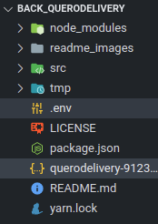

# Onboarding Motoboys

<p>
Essa aplicação utiliza 
<a href="https://nodejs.org/en/download/">NodeJS</a>,
<a href="https://docs.mongodb.com/manual/installation/">MongoDB</a> e 
<a href="https://classic.yarnpkg.com/en/docs/install/#debian-stable">Yarn</a>. Necessário instalá-los em sua máquina antes de tudo.
</p>

<p>Além disso é necessário a <a href="https://docs.aws.amazon.com/pt_br/AmazonS3/latest/user-guide/what-is-s3.html">criação de um bucket no Amazon S3</a> e 
<a href="https://github.com/googleapis/nodejs-vision/blob/master/README.md">
  adquirir um arquivo JSON da Google Cloud Vision API para autenticação</a>.
</p>

<br><br>

# Iniciando a aplicação

## 01. Clonar repositório
```bash
$ git clone https://github.com/lailton-b/back_querodelivery.git
```
<br>

## 02. Instalar dependências
```bash
back_querodelivery$ yarn
```
<br>

## 03. Adicionar arquivos contendo as variáveis de ambiente na pasta raíz


### Arquivo .env
```bash
APP_URL=http://localhost:8080

MONGO_URL=mongodb://localhost:27017/onboarding_motoboys

GMAILUSER=seu_email
GMAILPASS=sua_senha

STORAGE_TYPE=[local] ou [s3] (sem colchetes)

BUCKET_NAME=nome_do_seu_bucket

AWS_ACCESS_KEY_ID=sua_key_id
AWS_SECRET_ACCESS_KEY=sua_secret_access_key
AWS_DEFAULT_REGION=regiao_do_servidor_aws
```
<br>

## 04. Autenticar keys da google-vision-api (macOS e Linux)
```bash
back_querodelivery$ export GOOGLE_APPLICATION_CREDENTIALS="[PATH]"
```

Exemplo:
```bash
back_querodelivery$ export GOOGLE_APPLICATION_CREDENTIALS="./querodelivery-9123....json"
```
<br>

## 05. Iniciar servidor
```bash
back_querodelivery$ node src/index
```

<br>
<br>

# API

## API URL
http://localhost:8080
<br><br>

## Endpoints

```bash

### GET /register
Retorna todos os registros cadastrados

## Parametros
Nenhum

## Body
Nenhum

## Respostas

# HTTP CODE: 200
OK
Sem registros = []

Com registros:
[
  {
    "img": {
      "name": "image.jpg",
      "key": "d684fb491a0e301d24598360eaeab94d-image.jpg",
      "url": "http://localhost:8080/files/d684fb491a0e301d24598360eaeab94d-image.jpg"
    },
    "_id": "601aaec72417cd5f93941234",
    "name": "Nome do usuário",
    "cpf": "000.000.000-00",
    "cnpj": "00.000.000/0000-00",
    "address": "Endereço do usuário",
    "telephone": "(00) 00000-0000",
    "email": "E-mail do usuário",
    "status": "pendente || aprovado || reprovado",
    "disapproval_time": "Data e hora de quando o usuário foi reprovado",
    "redo_test": false || true,
    "createdAt": "Data e hora de quando o registro foi criado",
    "__v": 0
  }
]


# HTTP CODE: 500
{ 
  "message": "Um erro inesperado ocorreu. Por favor, tente novamente." 
}

```

<br>

```bash

### GET /register/000.000.000-00
Pesquisa por CPF, retornando registro caso exista

## Parametros
cpf

## Body
Nenhum

## Respostas

# HTTP CODE: 200
OK
[
  {
    "img": {
      "name": "image.jpg",
      "key": "d684fb491a0e301d24598360eaeab94d-image.jpg",
      "url": "http://localhost:8080/files/d684fb491a0e301d24598360eaeab94d-image.jpg"
    },
    "_id": "601aaec72417cd5f93941234",
    "name": "Nome do usuário",
    "cpf": "000.000.000-00",
    "cnpj": "00.000.000/0000-00",
    "address": "Endereço do usuário",
    "telephone": "(00) 00000-0000",
    "email": "E-mail do usuário",
    "status": "pendente || aprovado || reprovado",
    "disapproval_time": "Data e hora de quando o usuário foi reprovado",
    "redo_test": false || true,
    "createdAt": "Data e hora de quando o registro foi criado",
    "__v": 0
  }
]


# HTTP CODE: 400
Formato de CPF inválido
{ 
  "message": "CPF inválido, deve seguir o formato 000.000.000-00." 
}


# HTTP CODE: 404
Registro não encontrado
{
  "message": "CPF não encontrado."
}

```

<br>

```bash

### POST /register
Cria novo registro

## Parametros
Nenhum

## Body
Multipart Form

name: nome_do_usuario           (STRING)
cpf: 000.000.000-00             (STRING)
cnpj: 00.000.000/0000-00        (STRING)
address: endereço_do_usuario    (STRING)
telephone: (00) 00000-0000      (STRING)
email: email_do_usuario         (STRING)
file: imagem                    (.jpg, .pjpeg, .png)

## Respostas

# HTTP CODE: 200
OK
{
  "message": "Cadastro realizado com sucesso"
}


# HTTP CODE: 400
Formato de dados inválido
{ 
  "message": "Dado inválido, deve seguir o formato ..."  
}


Dado vazio / não enviado
{
  "message": "O dado não pode estar vazio."
}


# HTTP CODE: 409
Conflito (CPF, CNPJ, email ou telephone já cadastrados)
{
  "message": "CPF já cadastrado."
}

```

<br>

```bash

### PUT /register
Atualizar status de registro

## Parametros
Nenhum

## Body
JSON
{
  "id": "id_do_usuario",
  "status": "aprovado || reprovado || pendente"
}

## Respostas

# HTTP CODE: 200
OK
{
  "message": "Atualização feita com sucesso."
}


# HTTP CODE: 404
ID não encontrado
{
  "message": "ID inexistente."
}


#HTTP CODE: 400
Dado vazio / não enviado
{
  "message": "O dado não pode estar vazio."
}

```

<br>

```bash

### POST /selfie
Analisa se existe um rosto humano na imagem

## Parametros
Nenhum

## Body
Multipart Form

file: imagem      (.jpg, .pjpeg, .png)

## Respostas

# HTTP CODE: 200
OK

Existe rosto
{
  "message": true
}

Não existe rosto
{
  "message": false
}


# HTTP CODE: 401
Falha na autenticação
{
  "message": "Falha ao autenticar."
}

```